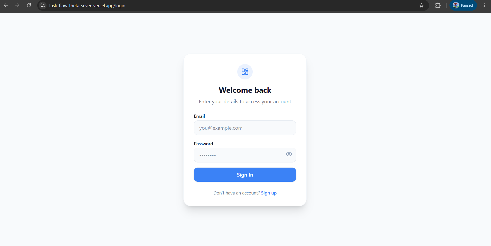
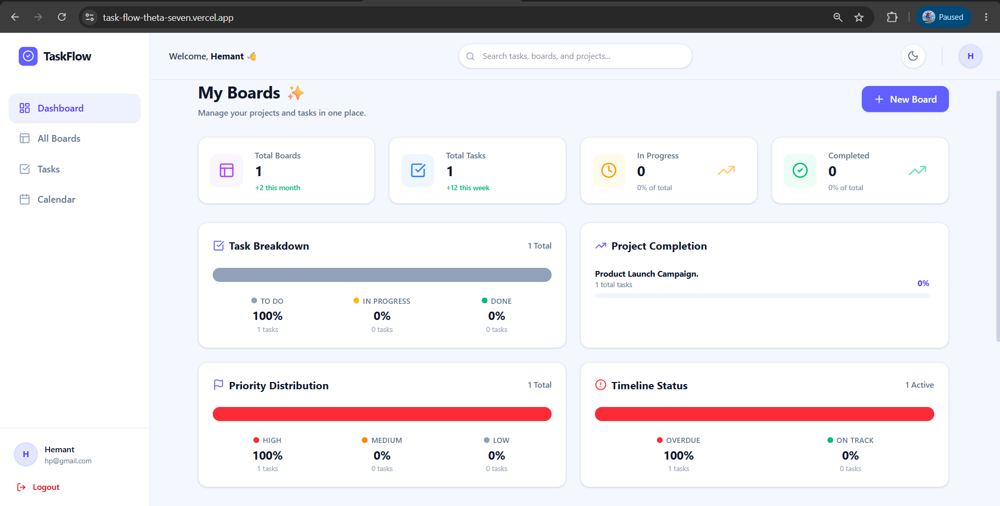
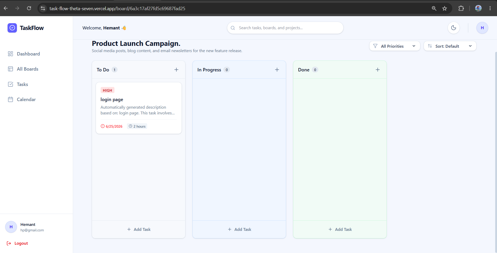
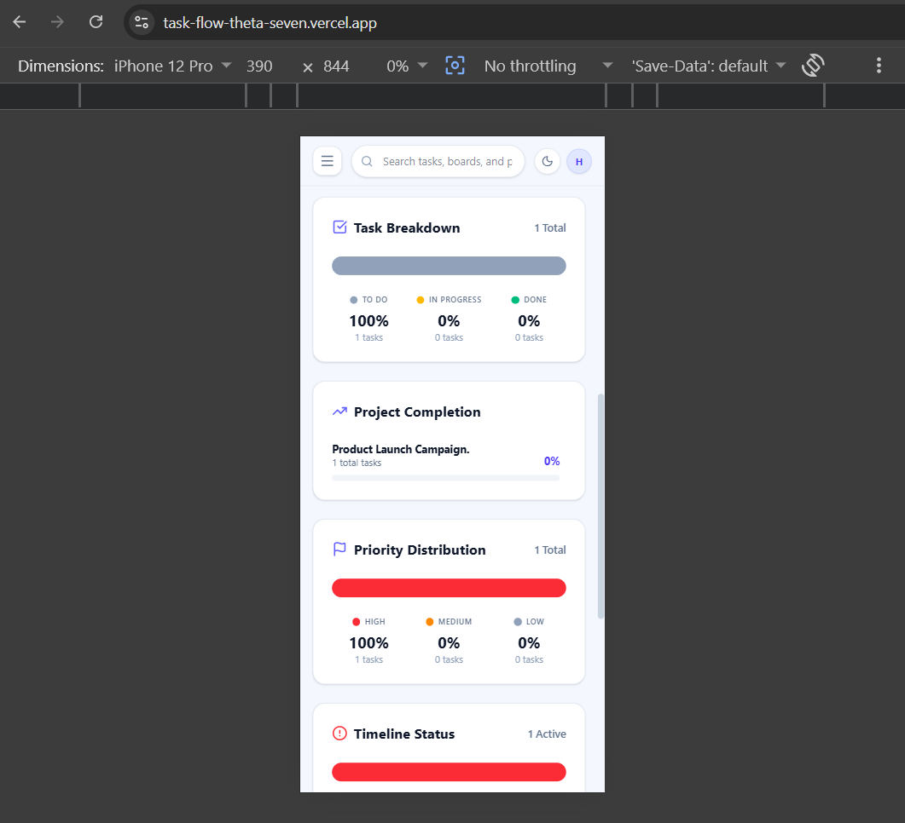

# TaskFlow - Project Management Dashboard 🚀

TaskFlow is a modern, full-stack project management application built with the MERN stack (MongoDB, Express, React, Node.js) designed to streamline team productivity. It features a responsive, beautifully crafted dashboard utilizing Tailwind CSS that allows users to organize projects, track deadlines, and manage tasks through an intuitive drag-and-drop Kanban board. A standout feature is the integration of the Google Gemini AI API, which acts as a virtual project manager—automatically analyzing task titles and descriptions to generate accurate effort estimations and logical due dates. Secure JWT authentication, robust global search, and dynamic analytics charts complete this powerful productivity tool.

## 🌍 Live Demo & Test Credentials
- **Frontend URL:** (https://task-flow-theta-seven.vercel.app/)
- **Backend URL:** (https://task-flow-ldhn.onrender.com)

**Test Account:**
- **Email:** `hp@gmail.com`
- **Password:** `123456`

## 📸 Screenshots

### Login & Authentication


### Main Dashboard & Analytics


### Kanban Board View (Drag & Drop)


### Responsive Mobile View


## 🛠️ Technology Stack
**Frontend:**
- React.js (Vite)
- Tailwind CSS v4
- React Router DOM
- @hello-pangea/dnd (Drag and drop)
- Axios & Lucide React

**Backend:**
- Node.js & Express.js
- JSON Web Tokens (JWT) & bcryptjs
- @google/genai (AI Integration)

**Database:**
- MongoDB & Mongoose (NoSQL)

## 🤖 AI Integration (Google Gemini)
**Which LLM API was chosen and why?**
For TaskFlow, we chose to integrate the Google Gemini API (specifically the gemini-2.5-flash model via the @google/genai SDK) instead of alternatives like OpenAI's ChatGPT or Anthropic's Claude.

**Why Gemini**?

Speed and Efficiency (Flash Model): Task management requires a snappy user interface. The gemini-2.5-flash model is heavily optimized for low latency. When a user clicks "Generate AI Estimate", they expect near-instant feedback to keep their workflow moving. Gemini delivers this JSON payload exceptionally fast.
Generous Free Tier for Development: For a portfolio or assignment project, managing API costs is crucial. Google currently offers a very generous free tier for the Gemini API, making it the perfect choice for an independent developer to build, test, and host the application without incurring unexpected cloud costs.
Structured JSON Output Support: A major requirement for this project was having the AI return predictable, machine-readable data (specifically an "estimated effort" and a "due date") rather than conversational text. The Gemini API handles system instructions and structured JSON generation flawlessly..

**How the AI feature works:**
The AI feature in TaskFlow is designed to act as a "virtual project manager" that analyzes a task and predicts how much effort it will take and when it should reasonably be completed. Here is the exact technical flow:

Step 1: The User Request (Frontend) When a user is creating or editing a task inside a project board, they enter a Title (e.g., "Implement JWT Auth") and a Description. Instead of manually guessing the due date, they click the "✨ Generate AI Estimate" button. The React frontend immediately takes the title and description and sends an HTTP POST request to our secure backend route (/api/ai/estimate).

Step 2: The Secure Backend Prompt (Node.js/Express) For security reasons, the frontend never talks to the AI directly. Our Node.js backend catches the request. It securely retrieves the hidden GEMINI_API_KEY from the .env file and constructs a highly specific "System Prompt". The backend instructs Gemini: "Act as a senior software project manager. Analyze the provided task title and description. Respond ONLY with a valid JSON object containing exactly two keys: estimatedEffort (a string like '3 hours' or '2 days') and dueDateOffset (an integer representing the number of days from today the task should take)."

Step 3: AI Processing & Response The backend sends this prompt, along with the user's task details, to the Google Gemini model. Gemini analyzes the complexity of the text. For example, it recognizes that "Fix button color" is a 1-day task, while "Build payment gateway" is a 7-day task. It returns the raw JSON string.

Step 4: Parsing and UI Update (Frontend) The backend parses the AI's JSON response and sends it back to the React frontend. The frontend does the final math: it takes the dueDateOffset (e.g., 3 days), adds it to today's date to create an actual calendar dueDate, and then automatically fills in the Due Date and Description form fields for the user. The user can then review the AI's estimation and save the task!

## 🚀 Getting Started Locally

### Prerequisites
- Node.js installed
- A MongoDB cluster URI (Atlas)
- A Google Gemini API Key

### 1. Clone the repository
```bash
git clone https://github.com/hemant-prajapat20/Task_Flow.git
cd Task_Flow
```

### 2. Backend Setup
```bash
cd backend
npm install
```
Create a `.env` file in the `backend` directory (see `.env.example` below) and add your keys.
Start the backend server:
```bash
npm run dev
```

### 3. Frontend Setup
Open a new terminal window:
```bash
cd frontend
npm install
```
Create a `.env` file in the `frontend` directory:
```env
VITE_API_URL=http://localhost:5000/api
```
Start the frontend development server:
```bash
npm run dev
```
The application will run at `http://localhost:5173`.

## 🔐 Environment Variables (.env.example)
Please refer to the `backend/.env.example` file for the required backend variables:
```env
PORT=5000
MONGO_URI=mongodb+srv://<username>:<password>@cluster.mongodb.net/taskflow?retryWrites=true&w=majority
JWT_SECRET=your_super_secret_jwt_key_here
GEMINI_API_KEY=your_google_gemini_api_key_here
```

## 📡 API Documentation

| Method | Endpoint | Purpose |
|--------|----------|---------|
| **POST** | `/api/auth/register` | Register a new user account |
| **POST** | `/api/auth/login` | Authenticate user & receive JWT token |
| **GET** | `/api/boards` | Fetch all boards for the authenticated user |
| **POST** | `/api/boards` | Create a new project board |
| **PUT** | `/api/boards/:id` | Update a board's title/description |
| **DELETE** | `/api/boards/:id` | Delete a board and all its associated tasks |
| **GET** | `/api/tasks/board/:id` | Fetch all tasks belonging to a specific board |
| **POST** | `/api/tasks/board/:id` | Create a new task in a specific board |
| **PUT** | `/api/tasks/:id` | Update a task (including drag-and-drop status changes) |
| **DELETE** | `/api/tasks/:id` | Delete a specific task |
| **POST** | `/api/ai/estimate` | Send task details to Gemini API for effort estimation |
| **GET** | `/api/search` | Globally search tasks and boards by query string |


## ⚠️ Known Issues & Future Improvements
**Limitations:**
- The application currently operates in a single-user context (workspaces are private to the logged-in user). There is no multi-user collaboration or board sharing yet.
- Task ordering within the exact same column does not persist strictly on refresh (it groups by status, but strict index ordering requires an indexing schema update).

**What I would improve with more time:**
1. **WebSockets (Socket.io):** Implement real-time updates so if a board is shared, multiple users can see drag-and-drop actions happen instantly without refreshing.
2. **Team Collaboration:** Add Role-Based Access Control (RBAC) allowing users to invite team members to specific boards as Viewers or Editors.
3. **Automated Testing:** Implement comprehensive unit and integration tests using Jest and Cypress to ensure UI stability.
4. **Cross-Board Dragging:** Allow users to drag a task from one board directly into another.
